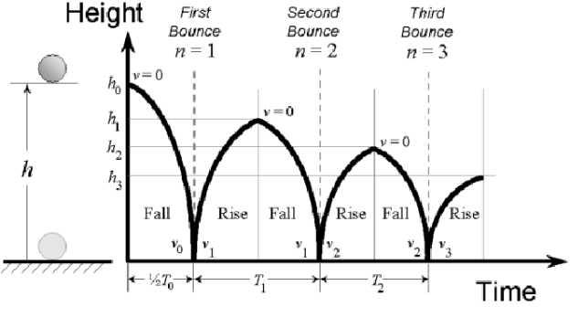

## Frontend Problem Statement
There is an use case where a ball is dropped at certain height h1 to a fixed horizontal plane and then the ball bounces back at height h2  and drops at height h3 and so on till the height becomes 0.You have to develop a web application which will plot a graph between all the heights and  time and display total number of bounce, where coefficient of restitution  value can be changed via slider.

## Backend Problem Statement
There is an use case where a ball is dropped at certain height h1 to a fixed horizontal plane and then the ball bounces back at height h2  and drops at height h3 and so on till the height becomes 0.You have to develop a Restful API in NodeJs which will
Return number of bounces and an array of coordinates that can be used to plot a graph between all the heights and  time, where coefficient of restitution,h1 are variable.
An API which will return result of past calculations.(For storing calculations use json file instead of any database). 

## Please refer image for more information

